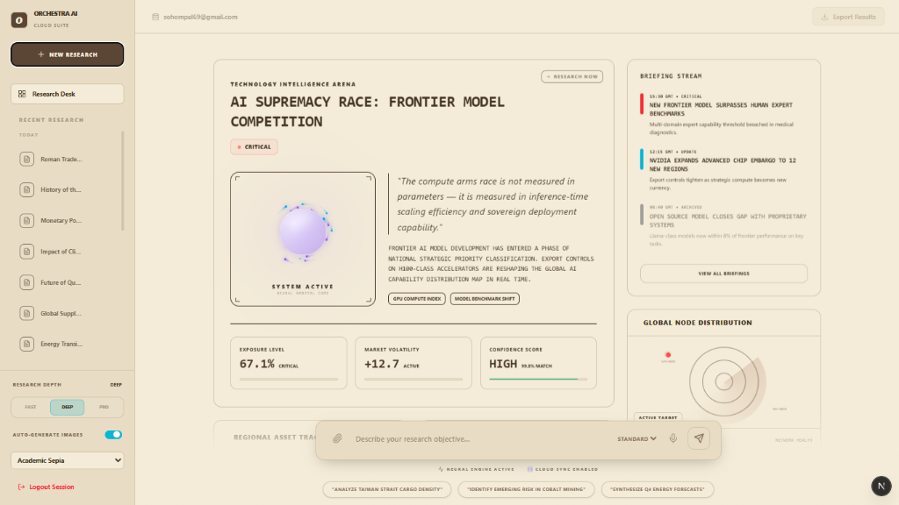
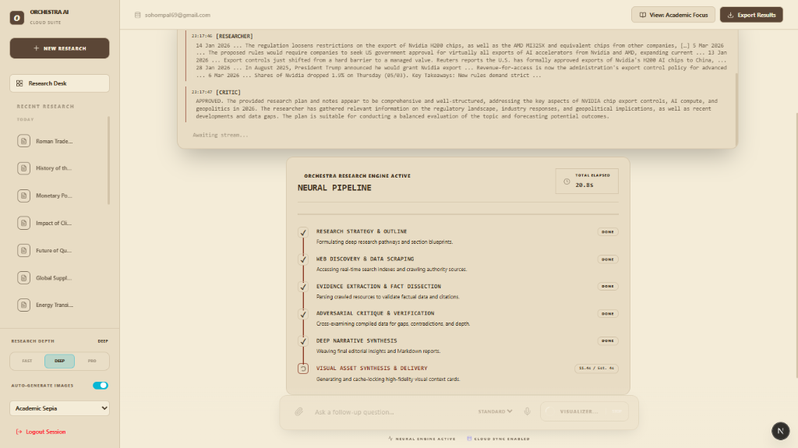
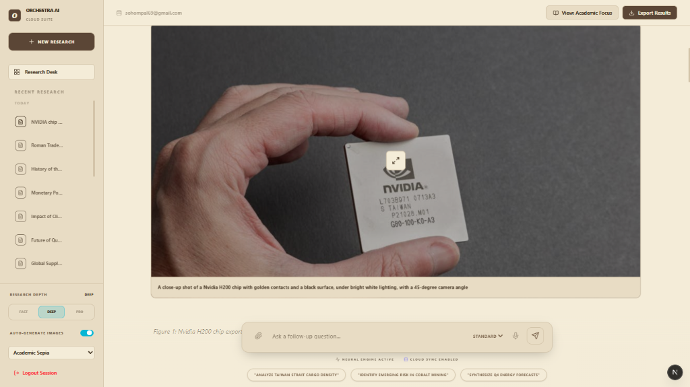

# 🎻 Orchestra AI — Swarm Intelligence Research Platform

Orchestra AI is a state-of-the-art, multi-agent cooperative research platform that automates deep data context scraping, narrative synthesis, adversarial validation, and period-accurate stock media visualization. 

Powered by **LangGraph**, **Groq**, and **Google Gemini**, the application deploys an autonomous swarm to produce publication-grade research papers. It features a retro-futuristic dark neon interface equipped with comprehensive PDF/Word export tools.

---

## 🚀 Visual Interface Audits & Screenshots

*Here is a preview of the premium, sepia-toned glassmorphism user interface. You can save your screenshots in a folder named `screenshots` in the root of this repository and they will display beautifully!*

| **Landing Desk & Controller Board** | **Multi-Agent Neural Matrix Terminal** |
| :---: | :---: |
|  |  |
| *Modern control console where users configure research depth and personas.* | *Retro-themed terminal displaying live coordinate streams between active agents.* |

### Sanitized Publication Report

*Beautifully typeset academic output containing zero modern visual anachronisms.*

---

## 🌟 Premium Architecture & Capabilities

### 1. Multi-Depth Swarm Engine (FAST / DEEP / PRO)
Orchestra AI dynamically scales its agent coordination based on the requested research complexity:
* **FAST Depth (Standard Persona):** Instantly synthesizes literature reviews and general topic briefs.
* **DEEP Depth (Visionary Persona):** Deploys internal vector scrapers and NOAA field models over multiple cycles.
* **PRO Depth (Skeptic Persona):** Runs adversarial verification cycles. The **Critic Agent** inspects drafts, checks logical assumptions, and forces rewrites until the briefing is robust.

### 2. Triple-API Image Fallback Cascade
To guarantee beautiful, relevant visual aids, the **Visualizer Agent** queries three media APIs sequentially:
1. **Wikimedia Commons API:** Checked first to retrieve highly factual, scientific, and public-domain figures.
2. **Pexels API & Unsplash API:** Leveraged as professional backups to fetch high-contrast, atmospheric stock illustrations.
3. **Dynamic Seed Fallback:** Protects the UI from broken icons by generating styled abstract placeholders when APIs rate-limit.

### 3. Geopolitical & Temporal Sanitization (Anti-Anachronism)
To avoid jarring visual errors in historical research, the visual prompt engine sanitizes queries dynamically:
* Intercepts modern leakages and translates them:
  - *European Union meeting* -> **Roman senate assembly**
  - *Checkpoint* -> **Fortress outpost**
  - *Computer/Office* -> **Parchment scrolls/Ancient study**
  - *Fluorescent lights* -> **Oil lamps**
* Prepends historical constraints to lock visual stock engines into ancient themes.

### 4. Double-Layered Rate Limiting & Throttling
Engineered for industrial-grade protection:
* **Client-Facing Sliding Window:** Caps `/research` & WebSockets (5 req/min), `/stt` Whisper transcription (5 req/min), and `/upload` embedding generation (5 req/min) to prevent compute cost abuse. Returns clean `429 Too Many Requests` responses with `Retry-After` headers.
* **Internal Third-Party API Protections:** Restricts Groq to 30 RPM and Gemini to 15 RPM. Incorporates strict `asyncio.Semaphore` and stagger gaps for DuckDuckGo Search (concurrency 1, 1.5s delay) and visual media queries (concurrency 2, 1.0s delay) to avoid provider IP blocks.

---

## 📂 Repository Directory Tree

```
Orchestra-Ai-GitHub/
├── backend/                  # FastAPI & LangGraph backend server
│   ├── agents.py             # LangGraph state swarm & image translation rules
│   ├── database.py           # Supabase vector storage & limit ceiling (15 ceiling)
│   ├── rate_limiter.py       # High-performance async sliding window tracking
│   ├── main.py               # WS streaming controllers & rate-limiting middleware
│   ├── requirements.txt      # Python backend packages
│   └── static/               # Local cache & image metadata storage
│
├── frontend/                 # Next.js & React Flow client application
│   ├── src/
│   │   ├── app/              # Next.js pages and routing
│   │   └── components/       # Custom React Flow graph, terminal, and viewer
│   ├── package.json          # Node dependency manifest
│   ├── tailwind.config.ts    # Styled sepia & glassmorphism configurations
│   └── tsconfig.json         # Strict TypeScript settings
│
├── .gitignore                # Global ignore rules (ignores node_modules, .env, .venv)
└── README.md                 # Primary system manual
```

---

## 🚀 Setup & Local Execution

Follow these detailed, step-by-step instructions to get Orchestra AI running on your local machine.

### 1. Prerequisites & Account Setup

Before you begin, ensure you have the required software installed and have created accounts for the necessary APIs.

**Software Requirements:**
- **Python 3.10+**: Download from [python.org](https://www.python.org/downloads/). Ensure you check "Add Python to PATH" during installation.
- **Node.js 18+**: Download from [nodejs.org](https://nodejs.org/). This is required to run the Next.js frontend.
- **Git**: Download from [git-scm.com](https://git-scm.com/) (Optional, but recommended for cloning the repository).

**API Keys Required (All offer generous free tiers):**
1. **Groq API Key**: Go to [console.groq.com](https://console.groq.com) and generate an API key for the ultra-fast LLM routing.
2. **Google Gemini API Key**: Go to [Google AI Studio](https://aistudio.google.com/) to get a key for embeddings and heavy reasoning tasks.
3. **Pexels & Unsplash API Keys**: Go to [Pexels API](https://www.pexels.com/api/) and [Unsplash API](https://unsplash.com/developers) for the image fallback cascade.
4. **Supabase Account**: Go to [supabase.com](https://supabase.com), create a new project, and locate your `Project URL` and `anon public` key in the Project Settings -> API section.

---

### 2. Backend Installation & Boot (FastAPI)

The backend handles the AI agents, vector database interactions, and API rate-limiting.

1. **Clone the repository and navigate to the backend folder:**
   ```bash
   git clone https://github.com/Sohom10/Orchestra-Ai.git
   cd Orchestra-Ai/orchestra-ai/backend
   ```
   *(If you downloaded the ZIP file, simply extract it and open your terminal inside the `orchestra-ai/backend` folder).*

2. **Create an isolated Python virtual environment:**
   This ensures dependencies don't conflict with other projects on your computer.
   ```bash
   python -m venv .venv
   ```

3. **Activate the virtual environment:**
   - **On Windows:**
     ```bash
     .venv\Scripts\activate
     ```
   - **On macOS / Linux:**
     ```bash
     source .venv/bin/activate
     ```
   *(You should now see `(.venv)` at the start of your terminal prompt).*

4. **Install the required Python packages:**
   ```bash
   pip install -r requirements.txt
   ```

5. **Configure your Environment Variables:**
   - In the `backend` folder, you will see a file named `.env.example`. 
   - Rename this file to exactly `.env` (or copy it: `cp .env.example .env`).
   - Open the new `.env` file in a text editor and replace the placeholder text with your actual API keys:
     ```env
     GROQ_API_KEY=gsk_your_real_key_here...
     GOOGLE_API_KEY=AIza_your_real_key_here...
     PEXELS_API_KEY=...
     UNSPLASH_API_KEY=...
     SUPABASE_URL=https://your-project.supabase.co
     SUPABASE_ANON_KEY=ey...
     ```

6. **Launch the FastAPI Server:**
   ```bash
   python main.py
   ```
   *(The server will start on `http://localhost:8000`. Leave this terminal window open and running).*

---

### 3. Frontend Installation & Boot (Next.js)

The frontend provides the interactive user interface, research controls, and sanitized report viewing.

1. **Open a NEW terminal window** (keep the backend terminal running).

2. **Navigate to the frontend folder:**
   ```bash
   cd path/to/Orchestra-Ai/orchestra-ai/frontend
   ```

3. **Install the Node.js packages:**
   ```bash
   npm install
   ```

4. **Configure your Environment Variables:**
   - In the `frontend` folder, you will see a file named `.env.example`.
   - Rename it to exactly `.env.local` (or copy it: `cp .env.example .env.local`).
   - Open `.env.local` in a text editor and add your Supabase credentials so the frontend can handle user authentication:
     ```env
     NEXT_PUBLIC_API_URL=http://localhost:8000
     NEXT_PUBLIC_SUPABASE_URL=https://your-project.supabase.co
     NEXT_PUBLIC_SUPABASE_ANON_KEY=ey...
     ```

5. **Start the Next.js Development Server:**
   ```bash
   npm run dev
   ```

6. **Launch the Application:**
   Open your web browser and navigate to **[http://localhost:3000](http://localhost:3000)**. You can now log in and start generating autonomous research!

---

## 📄 License
Distributed under the MIT License. Created by Sohom Pal.
